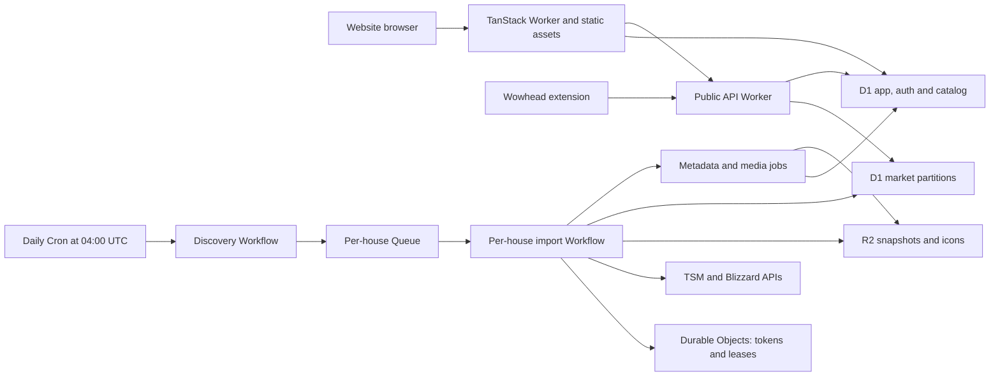

**Auctionoton: Cloudflare migration assessment**

Research date: 13 September 2026. Repository baseline: `9e45db0`.

**Implementation update:** the Cloudflare staging trial is now deployed. The existing TanStack website renders on Workers, D1-backed Better Auth sign-in/sign-out works, and a live discovery → Queue → Workflow import published 4,299 prices from a 609,757-byte R2 archive. The market D1 database occupies 274,432 bytes including schema and indexes. A repeated import did not add rows or change the sample timestamp, and a subsequent Alchemy plan reported no changes. Automatic cron remains disabled. These are measurements of one auction house, not the existing PostgreSQL database or total daily growth. See the [trial runbook](../packages/infrastructure/README.md) and [recorded results](cloudflare-trial-results.md).

**Recommendation: use Alchemy for application infrastructure, with shared Access resources in the existing `cloudflare-infra` Terraform repository.** Keep TanStack Start, move the API to a Worker, replace PostgreSQL with D1, and rebuild ingestion around durable jobs. The database, authentication, and ingestion changes account for most of the work.

The agreed initial auction refresh frequency is **once a day**. Proposed execution time: `0 4 * * *`, or 04:00 UTC, which is 06:00 in Amsterdam during summer and 05:00 during winter. The frequency is confirmed; the time is an implementation default. Cloudflare interprets Cron Triggers in UTC. [Cron Triggers documentation](https://developers.cloudflare.com/workers/configuration/cron-triggers/)

This assessment covers project-owned hosting, databases, caches, authentication, scheduled work, media delivery, analytics, secrets, build execution, and releases. TSM and Blizzard remain external data suppliers; Wowhead remains the website the extension augments. Extension code runs in the user's browser, and Chrome/Firefox stores distribute it. GitHub can remain the source repository while Cloudflare runs builds and releases. These are integration boundaries to keep visible when saying everything moves to Cloudflare.

Repository code and current primary documentation informed the original assessment below. The subsequent trial inspected the Cloudflare account and provisioned staging resources; it has not migrated production data or inspected the existing scheduler. PostgreSQL refused connections from this workspace, so production size and growth remain unknown.

**What exists today.** Both application schemas currently define the same six PostgreSQL tables. The website reads that database directly; moving only the API would leave a separate database dependency in the website.

| Area | Repository evidence | Required work |
| --- | --- | --- |
| Website | [Vite configuration](../apps/website/vite.config.ts), [package](../apps/website/package.json) | TanStack Start with Nitro `node-server` output. Replace the deployment adapter and Node start command with a Worker build; preserve SSR, server functions, static assets, SEO routes, and private response caching. |
| Public API | [entrypoint](../apps/server/src/index.ts), [item service](../apps/server/src/api/item/index.ts) | Elysia on Bun, `Bun.file`, `.listen()`, environment globals, and database connections. Convert handlers and dependencies to Workers bindings. Preserve `/health`, `/realms/:region/:version`, `/item/:id/ah/:ah_id/:version`, OpenAPI documentation, CORS, and response/error shapes. |
| SQL storage | [server schema](../apps/server/src/db/schema.ts), [website schema](../apps/website/src/db/schema.ts), [migration notes](../apps/server/README.md) | Convert PostgreSQL types and queries to SQLite/D1. Consolidate schemas and migration ownership. Reconcile the actual production schema before exporting; the merged migration history explicitly targets a fresh database. |
| Search and user mutations | [search](../apps/website/src/actions/search.ts), [dashboard actions](../apps/website/src/actions/dashboard.ts), [recent searches](../apps/website/src/queries/search.ts) | Replace `pg_trgm` similarity ranking and interactive transactions. Rewrite raw query result handling and latest/previous-price joins for the new storage layout. |
| Redis | [client and keys](../apps/server/src/kv.ts), [TSM client](../apps/server/src/utils/tsm.ts) | Replace OAuth caching, realm caching, and six-hour fetch markers according to their consistency needs. |
| Auction ingestion | [fetch script](../apps/server/src/scripts/fetch-auction-houses.ts), [bulk writer](../apps/server/src/api/item/auction-house.ts) | A top-level Bun script visits EU/US and `seasonal`, `era`, `classic`, `hardcore`, then exits. Its comment about fetching only seasonal is stale. No tracked cron expression or scheduler configuration invokes it. |
| Other maintenance | [metadata](../apps/server/src/scripts/fetch-item-metadata.ts), [media](../apps/server/src/scripts/fetch-item-media.ts), [cleanup](../apps/server/src/scripts/delete-old-items.ts) | Move all three jobs. Metadata/media currently call Blizzard; cleanup deletes prices older than 30 days and runs PostgreSQL `VACUUM FULL` and `REINDEX`. |
| Authentication | [middleware](../apps/website/src/start.ts), [auth service](../apps/website/src/services/auth.ts), [root document](../apps/website/src/routes/__root.tsx) | Clerk provides hosted authentication, middleware, UI, and user IDs used by stored collections/searches. Replacing its SDK alone does not migrate users. |
| Realm catalog | [website realm constants](../apps/website/src/services/realms.ts), [auction-house lookup](../apps/website/src/services/auction-house.ts) | The website has hardcoded seasonal realms, while the API discovers realms from TSM. Move authoritative realm records into Cloudflare storage and preserve existing realm URLs. |
| Images and analytics | [media job](../apps/server/src/scripts/fetch-item-media.ts), [root document](../apps/website/src/routes/__root.tsx), [extension popup](../apps/extension/src/entrypoints/popup/index.html) | Icons point to third-party URLs; both clients reference `plausible.sandervspl.dev`. Import image bytes and replace the analytics dependency. |
| Extension and releases | [API URL](../apps/extension/src/utils/auctionotonApi.ts), [WXT config](../apps/extension/wxt.config.ts), [Chrome release](../.github/workflows/deploy-chrome.yml) | Preserve the public API hostname for installed versions, clean up legacy Vercel/ngrok permissions, validate Chrome/Firefox access, and move packaging/upload execution to Cloudflare. |
| Deployment and checks | [Nixpacks](../nixpacks.toml), [CI](../.github/workflows/ci.yml), [smoke tests](../apps/website/tests/smoke.test.mjs) | Remove the long-running server deployment. Current smoke tests launch Node output and deliberately avoid real database/auth access; replace the launcher and add migration-specific integration checks. |

**Why Alchemy fits, and where it needs proof.** The checked npm `latest` version is `2.0.0-beta.77`, released on 9 September 2026. The project explicitly describes v2 as beta with possible breaking changes. Pin an exact tested version. Older examples using v1's async resource declarations and `finalize()` describe a different API; v1 state also requires migration before v2 can adopt its resources. [Current release](https://github.com/alchemy-run/alchemy/releases/tag/v2.0.0-beta.77), [Alchemy overview](https://alchemy.run/), [v1 migration guide](https://alchemy.run/migrating-from-v1)

| Decision factor | Assessment |
| --- | --- |
| Resource coverage | Good match: Workers, TanStack sites, D1, R2, KV, Durable Objects, Queues/consumers, Cron Triggers, Workflows, DNS, and secrets can share a TypeScript resource graph. The relevant resources have current documentation. [Workers](https://alchemy.run/cloudflare/compute/workers), [D1](https://alchemy.run/providers/cloudflare/d1/database), [Queues](https://alchemy.run/cloudflare/messaging/queues), [Workflows](https://alchemy.run/cloudflare/compute/workflows) |
| Existing pnpm monorepo | A root stack can compose resources from the app packages and provide isolated stages. Introduce a small infrastructure package if needed to keep deployment dependencies separate from application dependencies. [Monorepo guidance](https://alchemy.run/project-structure/monorepo) |
| All state on Cloudflare | `Cloudflare.state()` stores deployment state in a Worker/Durable Object with SQLite and keeps its authentication/encryption material in Secrets Store. This avoids an external state service. Bootstrap it deliberately: even an initial `plan` can prompt to create the state service. [State store](https://alchemy.run/state-store/) |
| Application coupling | Keep ordinary async Worker handlers and native bindings. Effect belongs in the infrastructure definition unless application code benefits from it. The current package requires Effect 4-compatible dependencies; its optional Drizzle integration targets a Drizzle release candidate. Use native D1/Drizzle access and committed SQL migrations to avoid coupling this migration to that optional integration. [Package metadata](https://registry.npmjs.org/alchemy/latest), [async Worker support](https://alchemy.run/cloudflare/compute/workers) |
| TanStack integration | Alchemy v2's `Cloudflare.Website.Vite` supplies its own integration and says to remove `@cloudflare/vite-plugin`. Cloudflare's standard Wrangler route uses that plugin. Choose one build path and remove Nitro's Node adapter; test the project's pinned TanStack/Vite versions with it. [Alchemy TanStack guide](https://alchemy.run/cloudflare/frontend/tanstack-start/), [Cloudflare TanStack guide](https://developers.cloudflare.com/workers/framework-guides/web-apps/tanstack-start/) |
| Data safety | Most resources default to destruction on removal. Explicitly retain production databases, buckets, and resources owning durable state; keep stable logical/physical names. Retention leaves the cloud resource alive but removes Alchemy's ownership record, so it is not a backup or full deletion lock. [Lifecycle/removal policies](https://alchemy.run/infrastructure-as-code/resource-lifecycle) |
| Deployment integration | Prove noninteractive Alchemy deployment from Workers Builds, required token permissions, remote state recovery, and serialization per stage. Alchemy's CI guide primarily demonstrates GitHub Actions. Cloudflare supports custom deploy commands, but that alone does not prove this exact integration. [Alchemy CI](https://alchemy.run/environments/ci), [Workers Builds configuration](https://developers.cloudflare.com/workers/ci-cd/builds/configuration/) |

The adoption gate is a 1–2 day trial: deploy a staging TanStack page, public API route, D1 read/write, R2 object, and queue-to-workflow job using the intended versions. Run that deployment from Workers Builds, repeat it without duplicate resources, simulate an interrupted deployment, and verify data retention. Include a real representative auction payload and a D1-backed auth session in the trial. This is proposed implementation work, not a completed test.

If that trial fails because of Alchemy, use the official Cloudflare Vite/Wrangler path for application deployment and the Cloudflare Terraform provider for resource provisioning. The target services and migration work remain applicable. Each resource and database migration history must have one deployment owner. [Cloudflare Terraform provider](https://developers.cloudflare.com/terraform/)

**Authentication update (2026-09-13):** the website source now replaces Clerk with Access, following Bingo. Access resources and a permanent-password OIDC service on Workers/D1 live in `cloudflare-infra`. The selected methods are Google and permanent passwords, with Cloudflare Email Sending for verification/recovery. The isolated backend Better Auth trial remains historical evidence; the new dedicated service supplies the password identity to Access. See [implementation and deployment gates](cloudflare-access.md).

**Target services.** Use Cloudflare products where they replace an existing responsibility or solve a specific migration requirement.

| Responsibility | Cloudflare target | Design |
| --- | --- | --- |
| Website and auth endpoints | Workers + Static Assets | TanStack Start SSR and server functions, with verified Cloudflare Access sessions in the website Worker. |
| Public API | Worker + Hono | Port the three explicit routes and API documentation. Hono has direct Workers support; the current Elysia Cloudflare adapter is documented as experimental, and the installed Bun entrypoint cannot run unchanged. [Hono guide](https://hono.dev/docs/getting-started/cloudflare-workers), [Elysia adapter](https://elysiajs.com/integrations/cloudflare-worker) |
| App records and item catalog | D1 | One shared app/catalog schema containing collections, recent searches, owner mappings, metadata, and realm routing records. |
| Price data | D1 market databases | Route by region/version, splitting large partitions by auction-house key when measurements require it. Keep 30-day price retention and the existing seven-day chart query. Confirm physical database count from the trial. |
| Snapshot archive and icons | R2 | Private raw snapshots, import exports, and replay manifests; a separate public icon bucket/custom domain. Import existing retained history before retiring PostgreSQL. |
| Public read caching | Workers Cache; KV for realm/config snapshots | Cache public data with freshness-aware keys/TTLs. Auth, dashboards, and private server functions keep `private, no-store`. |
| Coordination and tokens | SQLite Durable Objects | Coordinate upstream credentials/quotas and per-house leases. Store token expiry and refresh ownership durably. KV can cache noncritical realm/config reads. |
| Scheduled and background work | Cron Triggers + Queues + Workflows | One daily dispatcher, bounded per-house work, resumable imports, metadata/media jobs, cleanup, failure records, and replay. |
| Customer identity | Cloudflare Access | Dedicated reusable policy and separate stage audiences, managed in `cloudflare-infra`; app-side JWT and ownership validation. Google plus the dedicated password OIDC Worker/D1 service; Cloudflare Email Sending handles verification and recovery. OTP is excluded. See [Access implementation](cloudflare-access.md). |
| Analytics and operations | Web Analytics, Workers Analytics Engine, Workers Logs/Traces | Replace Plausible page metrics; record extension/API events through a Worker where needed. Store exact job completion records in D1 and longer-lived exports in R2. [Web Analytics](https://developers.cloudflare.com/web-analytics/), [Analytics Engine](https://developers.cloudflare.com/analytics/analytics-engine/) |
| Domain, access, and secrets | DNS/TLS, WAF/rate limiting, Turnstile, Access, Worker secrets/Secrets Store | Protect customer auth forms with Turnstile and admin/replay endpoints with Access. Keep the public extension API usable without interactive challenges. Match WAF features to the actual zone plan. |
| Builds and release artifacts | Workers Builds + R2 | Run workspace checks, builds, extension packaging, and deployment on Cloudflare. Store browser ZIP/source artifacts in R2; call store publishing APIs from the release process. |

The website can use a service binding for shared public-data operations. App/catalog queries and market queries use separate D1 bindings; SQL cannot join across those databases, so the server composes metadata and price results. Shared query/contract packages keep that composition consistent between the API and website.

The diagram shows logical responsibilities. The scheduler, queue consumer, Workflow classes, and coordinating Durable Object classes can initially share one ingestion Worker deployment, alongside the separate website and API Workers.

**The daily auction job needs an explicit success model.** The current script stops after three caught errors, but lower layers swallow many failures. Two `finally` paths set the six-hour Redis marker even after failures, and successful fetching can set it before database writes finish. There are two process-local promise maps; neither coordinates separate Worker instances. TSM OAuth tokens share one Redis key even though the code selects four credential slots. A request-path `getAuctionHouse()` call also starts an unawaited full-house fetch without passing its result to the bulk writer.

Replace that behavior with this sequence:

1. **Discover the day's work.** A production-only `0 4 * * *` Cron Trigger starts a discovery Workflow using the scheduled UTC date as its logical run ID. Refresh the realm catalog, enumerate both regions and all four game versions, and deduplicate auction-house keys. Record expected jobs, including an explicit failure when a provider unexpectedly returns no realms. Validate the upstream version mapping; `classic` currently maps to the string `Wrath` in the code.
2. **Dispatch bounded jobs.** Enqueue one descriptor per house with environment, region, version, auction-house ID, and run ID. A queue consumer creates a deterministic per-house Workflow instance and acknowledges only after creation or confirmation that it already exists. Start with low concurrency, then tune using measured provider allowances. Enforce quotas at the actual upstream account/credential boundary, including credentials that share an allowance.
3. **Fetch and stage durably.** Claim an expiring lease, acquire the correctly scoped token, and stream the provider response to a private R2 object. Normalize in bounded chunks and checkpoint their object keys and counts. Record capture time separately from provider modification time. Retry timeouts, 429s using `Retry-After`, and appropriate 5xx responses; handle invalid credentials and malformed payloads explicitly.
4. **Commit one complete snapshot.** Write idempotent rows identified by logical snapshot and item/variant key. Keep a snapshot unpublished while chunks arrive. After counts and validation pass, atomically mark it complete and advance the house's published snapshot pointer in the same D1 database. Readers continue seeing the last complete snapshot through a failed partial import. A verified empty auction house must have an explicit valid-empty outcome.
5. **Finish and reconcile.** Queue missing metadata/icons, perform bounded retention cleanup, and compare completed/failed houses with the discovery manifest. Persist failure details and support replay from R2. Queue delivery failures use a dead-letter queue; terminal Workflow failures must separately record and enqueue their failure, since an already acknowledged queue message will not return automatically. Surface partial completion and a missing daily run through operational alerts.

Use stable logical snapshot keys across retries and conditional writes/unique constraints; Queues and Workflow retries can repeat side effects. A per-house lease must survive process loss, expire, renew during long work, and reject stale lease holders during publication. Replaying the same snapshot must not duplicate prices. Scope token caches by provider and credential identity without placing raw API keys in identifiers or logs.

The daily schedule changes freshness expectations. Remove the request handler's automatic three-hour full refresh behavior and the six-hour suppression markers. Public reads serve the latest completed daily snapshot and its true timestamp. Keep the previous snapshot during outages and mark it stale; use 26 hours since the last successful house update as an initial alert threshold. Do not update `lastUpdated` merely because an HTTP request succeeds. Any cold-miss enrichment should be separately bounded and should not trigger another full-house import. Manual full refreshes use the same controlled job path.

The extension's existing one-hour local cache can remain a read-cache interval; it must not cause another upstream ingestion. At one scheduled sample per day, the seven-day chart receives roughly seven new points. Preserve existing historical timestamps rather than manufacturing intraday samples.

Cloudflare currently limits queue messages to 128 KB and non-stream Workflow step results to 1 MiB. Store auction payloads in R2 and pass references through jobs. Workers have 128 MB per isolate, so the current whole-response `json()` plus array chunking must be measured or replaced with streaming normalization. A queue invocation also has a finite execution window; it should launch durable work rather than run the entire regional sweep. [Queue limits](https://developers.cloudflare.com/queues/platform/limits/), [Workflow limits](https://developers.cloudflare.com/workflows/reference/limits/), [Worker limits](https://developers.cloudflare.com/workers/platform/limits/)

Metadata discovery becomes a paginated reconciliation task and new-item queue. Preserve the version/locale needed for Blizzard requests; the existing metadata backfill always uses `seasonal`, and media uses a fixed seasonal namespace. Copy actual icon bytes into R2, deduplicate them, and ship a local placeholder. The cleanup job becomes indexed, bounded D1 deletes and R2 lifecycle rules. PostgreSQL maintenance commands disappear. Keep raw snapshots available for at least the 30-day price window, with longer retention for migration backups as explicitly configured.

**D1 requires a schema and query migration.** Hyperdrive accelerates access to an existing PostgreSQL/MySQL database; it would leave that database outside Cloudflare. D1 is the proposed replacement. [Hyperdrive documentation](https://developers.cloudflare.com/hyperdrive/)

| Change | Implementation detail |
| --- | --- |
| Shared data package | Create `packages/db` for `sqlite-core` schemas, D1 clients, committed migrations, and explicit row conversion. Create `packages/contracts` for API response shapes and identifiers used by the extension, website, and API. |
| PostgreSQL types | Replace `bigserial`, `numeric`, and timestamp defaults deliberately. Preserve legacy IDs or map them deterministically. Store price amounts as exact copper integers only after checking bounds and `Number.isSafeInteger`; use an exact text representation if values exceed JavaScript's safe range, with an explicit API compatibility decision. Preserve UTC semantics and handle nullable timestamps. |
| Ingestion schema | Add run/snapshot status, provider timestamps, counts, published/previous snapshot references, replay references, and unique idempotency keys. Include region/version in identity where necessary; verify whether provider AH IDs are globally unique. Backfill these missing dimensions in old rows using the verified realm/house mapping, and report ambiguous records. Preserve pet variants when supplied. |
| User ownership | Replace the globally unique `recent_searches.item_id` constraint with the intended user/item key and an upsert. Preserve collection ownership checks. Auth IDs require either preservation or a verified mapping applied to all user-owned records. |
| Atomic mutations | D1 `batch()` provides atomic statement batches; it does not execute the current interactive `db.transaction(async tx => ...)` flow unchanged. Use guarded SQL and predetermined IDs, or simplify the collection relationship schema, so ownership checks and changes are atomic. [D1 batch API](https://developers.cloudflare.com/d1/worker-api/d1-database/) |
| Item search | D1 supports FTS5, but it has no PostgreSQL `similarity()` function. Build indexed candidate search and bounded typo ranking in the Worker, then compare results against representative existing queries. FTS prefix search alone does not preserve typo tolerance. If retaining a `LIKE` fallback, account for D1's 50-byte pattern limit; the current input validator permits 200 characters. [D1 SQL support](https://developers.cloudflare.com/d1/sql-api/sql-statements/), [D1 limits](https://developers.cloudflare.com/d1/platform/limits/) |
| Read paths | Replace the item/metadata full join with a price read plus catalog lookup. Rewrite seven-day history, recent-search price differences, and dashboard composition for separate database bindings. Route reads to complete snapshots, including zero-auction and missing-metadata cases. |
| Migration ownership | Preserve the old PostgreSQL migrations as historical evidence and generate a new D1 history. Choose Alchemy's migration-directory integration or another sole migration runner. Alchemy adopts existing migration bookkeeping into its own table; do not alternate it with Wrangler/Drizzle migrators. [Alchemy D1 migrations](https://alchemy.run/providers/cloudflare/d1/database) |

D1's current paid per-database limit is 10 GB and cannot be increased. It also limits a SQL statement to 100 bound parameters; the current 2,000-row insert batches cannot carry over. Derive row count from the actual number of bound columns and keep each batch within the query time limit. Each database processes queries serially, so measure ingest throughput alongside interactive reads. Use a planning ceiling of about 6 GB per partition to leave room for indexes, overlap, and growth. [D1 limits](https://developers.cloudflare.com/d1/platform/limits/)

KV is eventually consistent, with changes potentially taking 60 seconds or longer to appear elsewhere. Use durable coordination for leases, token refresh ownership, and global upstream quotas. Keep authoritative sessions and permissions in D1. [KV consistency](https://developers.cloudflare.com/kv/concepts/how-kv-works/)

Production sizing requires database/table/index sizes, oldest/newest price timestamps, rows per house, largest provider payload, active house count, and query traffic. Define `H` as active houses and `I` as average items per house. At the agreed cadence, new price rows/day are approximately `H × I`; 30-day history is about `30 × H × I`. Retries should not increase that count.

For illustration only, 200 houses with 5,000 items each produce 1 million rows/day and 30 million retained rows. At an assumed 150 bytes/row, that is 4.5 GB before indexes and other tables. This is not a measurement of Auctionoton. An actual D1 import and row-size/index measurement must decide the partition count; split a large region/version by a stable auction-house partition key. Archive all existing retained records even if import volume requires a staged backfill.

**Authentication is a separate migration deliverable.** The website now implements Access JWT verification, sign-in/sign-out routes, account controls, and session-change cache invalidation. The infrastructure follows Bingo for Access, with a separate Cloudflare-hosted permanent-password OIDC provider. Existing user ownership still requires a verified import; current Clerk sessions cannot be reused. The [Access migration notes](cloudflare-access.md) record the ID-map mechanism, tests, pending work, and sign-out limitations.

Permanent passwords are confirmed. The implementation supplies an OIDC identity service on Workers/D1 with registration, mandatory verified email, recovery, PKCE, signed tokens, and Cloudflare Email Sending. Access offers only that provider and Google for each environment. [Access OIDC](https://developers.cloudflare.com/cloudflare-one/integrations/identity-providers/generic-oidc/)

**The remaining external dependencies need explicit removal.** Replace the two Plausible script references with Cloudflare analytics and archive any historical reports that need preserving. Send extension events through a packaged client to a Worker endpoint. Replace icon URLs in stored metadata as well as code defaults; an R2 bucket alone does not move existing image delivery. Replace the unused website API client's `localhost:3000/api` production setting if retaining it. Point the extension's NexusHub detail link at the Cloudflare-hosted item page when that page supports the corresponding version and realm.

Preserve `auctionoton-api.sandervspl.dev` through the API cutover so older installed extensions continue working. Configure DNS/custom domains and test actual browser extension requests, CORS preflights, cache headers, and missing-item behavior before enabling stricter API rules. Remove legacy Vercel/ngrok manifest entries from the next extension release and verify generated Chrome and Firefox manifests.

Worker bindings replace `DB_URL` and `REDIS_URL`. Keep TSM's client ID and four API-key slots, plus Blizzard's client ID/secret, in server-side secrets; remove Clerk settings only after auth migration. Inventory any use of `AUC_SECRET` before removing it. Separate build credentials from runtime credentials, and give preview stages independent data and secret access with production cron disabled.

Move `.github/workflows/ci.yml` and the execution in `deploy-chrome.yml` to Workers Builds once equivalent checks and store uploads work there. Use the repository root, pinned Node/pnpm versions, the frozen lockfile, and Turbo generation/checks. A single stage deployment owner should run the Alchemy stack; multiple worker builds must not race to mutate the same state or migrations. The auto-generated Worker deployment token may lack permissions for databases, queues, DNS, and state-store secrets, so configure the actual required build permissions. Document the initial Git/Builds connection if Alchemy does not provision it. [Builds configuration](https://developers.cloudflare.com/workers/ci-cd/builds/configuration/), [monorepo setups](https://developers.cloudflare.com/workers/ci-cd/builds/advanced-setups/)

Store extension archives and Firefox review sources in R2, preserving the current reproducible-source packaging. Replace the GitHub-specific Chrome upload action with a release script calling the store API from Cloudflare's build environment. Keep store secrets out of client bundles. GitHub remains a source integration, and browser-store review remains external.

**Implementation order and estimated effort.** These are engineering estimates for one developer familiar with the repository, assuming credentials and exports are available. Work proceeds in order; waiting for domain/account onboarding or store review can extend elapsed time.

| Phase | Concrete output and affected areas | Acceptance gate | Estimate |
| --- | --- | --- | --- |
| 1. Prove the platform and measure data | Root Alchemy stack/infrastructure package, staging resources, remote state, Workers Builds trial, representative auction import, D1-backed session; collect production inventory. | Current TanStack/Vite works, a job survives retry, repeat deployment is stable, and measured storage/throughput supports a partition plan. Choose Alchemy or the fallback here. | 1–2 days |
| 2. Migrate storage and API | Shared SQLite schema/contracts, D1 partitions, PostgreSQL export/import tooling, search replacement, mutation rewrites, Hono Worker, token/cache abstraction. | Preserved IDs and data counts, correct exact prices/timestamps, API response compatibility, search quality, ownership and batch rollback checks. | 4–6 days |
| 3. Move every background job | New `apps/ingestion`, daily Cron/Workflows/Queues, leases, R2 snapshots, metadata/media workers, cleanup, replay/status endpoints. | A full daily sweep covers all expected houses; duplicate delivery adds no rows; failures remain visible and never publish partial snapshots. | 3–5 days |
| 4. Move the website and user services | Worker build, Access and verified owner migration, the permanent-password identity service, live realm catalog, R2 icons, analytics, extension adjustments, complete build/release process. | SSR/assets/SEO and authenticated CRUD work; user data remains owned correctly; migrated users sign in; both extension builds use the Cloudflare API. | 4–6 days |
| 5. Cut over and retire old services | Production import/delta catch-up, DNS/API cutover, extension release, alerts, restore rehearsal, removal of Nixpacks and old CI/service dependencies. | Two consecutive daily runs succeed, old clients work, restore is demonstrated, and service/dependency inventory confirms completion. | 2–3 days |

Allow roughly **14–22 engineering days, or 3–5 working weeks**. The critical unknowns are actual price volume, authentication export complexity, and Alchemy/Workers Builds compatibility. A successful trial refines the estimate before the larger data migration.

**Verification and cutover must cover state, not only HTTP success.** Extend the existing smoke checks to launch the Workers build and test actual bindings. Use fixtures for provider failures and a small staging sample for live compatibility; avoid consuming a production-wide daily quota during routine tests.

| Check group | Required evidence |
| --- | --- |
| Data and application behavior | Reconcile per-table/per-house counts, history ranges, identity mapping, prices, nulls, and representative query results. Test search typos, seven-day charts, recent-search differences, collection ownership, auth transitions, SSR/assets, SEO, and private caching. |
| Failure handling | Inject 401/429/5xx responses, timeouts, invalid/empty data, duplicate jobs, failed D1 chunks, crashes after writes, expired leases, and deployment interruptions. Confirm a failed house does not stop unrelated houses and freshness advances only on successful publication. |
| Production readiness | Benchmark the largest payload and busiest partition, prove quotas/concurrency are respected, validate all four version mappings, check completion manifests, and alert on stale data, dead-letter messages, failed workflows, and missed schedules. |
| Restore and compatibility | Restore D1 data, rebuild a market snapshot from R2, recover Alchemy state, and verify the old public hostname with installed Chrome/Firefox versions. Code rollback does not restore database contents or Clerk sessions. |

Export the existing database and identity data, import into staging, and reconcile before production. During cutover, pause the old ingestion scheduler and user writes for the final delta, or implement an explicit change-capture path. Avoid simultaneous uncontrolled writes to old and new stores. Switch traffic only after validation, then enable the Cloudflare daily scheduler. Keep old exports and a defined rollback window; switching old code back after new D1 writes requires a tested reverse-sync strategy or a write freeze. Retire PostgreSQL, Redis, Clerk, Plausible, old app hosts, and the old cron only after the acceptance checks pass.

D1 Time Travel provides a recovery window, but independently preserve migration exports and raw snapshots in R2. Keep production data resources retained in Alchemy, document state-store credential recovery, and serialize deployments. Daily health should report completed versus expected houses, last successful snapshot, provider modification age, failed jobs, and the next scheduled run.

**Cost is driven by data volume and writes.** Workers Paid currently starts at $5/account/month; static asset requests are free. D1 Paid includes 50 million written rows/month and 5 GB storage, then charges $1/million written rows and $0.75/GB-month. Index maintenance and retention deletes add writes. A daily import can therefore produce much more billable work than its number of new history rows suggests. [Workers pricing](https://developers.cloudflare.com/workers/platform/pricing/), [D1 pricing](https://developers.cloudflare.com/d1/platform/pricing/)

R2 Standard storage is currently $0.015/GB-month beyond its allowance, with separate operation charges and no direct egress charge. Queues includes 1 million operations/month on Paid, then $0.40/million; typical successful delivery uses three operations per small message. Workflow CPU/state, Durable Objects, KV operations, logs, build minutes, email, and optional image transforms also need to enter the estimate. These rates do not establish a $5 total bill. [R2 pricing](https://developers.cloudflare.com/r2/pricing/), [Queues pricing](https://developers.cloudflare.com/queues/platform/pricing/), [Builds limits and pricing](https://developers.cloudflare.com/workers/ci-cd/builds/limits-and-pricing/)

**Other Cloudflare products have specific entry conditions.** Cloudflare Images can transform R2-hosted icons if responsive formats/sizing justify it. Browser Run becomes useful if a future source requires rendered pages; current ingestion uses JSON APIs. Containers are a Cloudflare-hosted fallback only if measured parsing or tooling cannot fit Workers. Workers AI/Vectorize could support a future semantic-search feature, and Pipelines/R2 Data Catalog/R2 SQL could support longer-term analytical queries. None is required to preserve today's auction lookup, dashboard, extension, and daily ingestion behavior. [Image transformations](https://developers.cloudflare.com/images/transform-images/)

The next implementation task is Phase 1: prove the pinned Alchemy stack with one representative auction-house import, a D1-backed session, and a deployment run from Workers Builds. Production database measurements and the current scheduler's location remain inputs to collect; the daily refresh frequency is settled.
